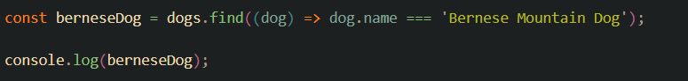

# Iteradores

## For

Es un bucle que permite repetir una serie de instrucciones un numero especifico de veces.

Ejemplo:

# forEach - Map

## forEach

Se utiiza para iterar sobre cada elemento de un arreglo

- Usos: Se utiliza cuando se quiere realizar una accion en cada elemento de un arreglo.

- Diferencias con el map: A diferencia de Map, el forEach no nos devuelve un nuevo arreglo.

## Map

Es un metodo que permite crear un nuevo arreglo a partir de otro

- Usos: Se utiliza para transformar los elementos de un arreglo y obtener un nuevo arreglo con los resultados

- Diferencias con el forEach: A diferencia del forEach, el metodo Map si nos permite crear nuevos arreglos a partir de un arreglo anterior.

 

 # Array Methods

 ## FIND

 Devuelve el primer elemento que cumpla la condicion.

 Ejemplo:

 

 ## SOME

 Devuelve true or false dependiendo la condicion de al menos uno.

 Ejemplo: 

 

## EVERY

Devuelve true or false solo si todos cumplen.

Ejemplo: 

## FILTER

Filtra el arreglo dependiendo de la condicion.

